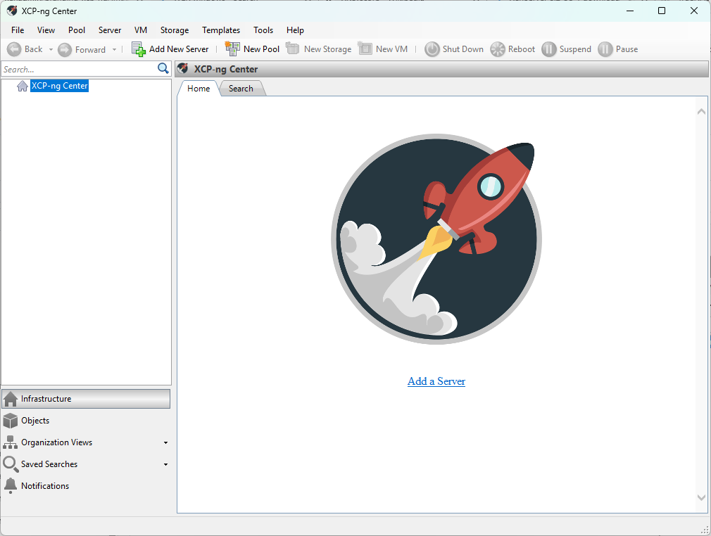

## Notice

XCP-ng Center is no longer EOL! We have a new maintainer (Michael Manley) to work on the current codebase and will maintain it for the foreseeable future.

Please submit any bug reports to the issue tracker. When reporting a bug make sure the following is done to make diagnostics easy for all:
* Make sure PDB's are installed. This will give more meaningful error messages on an exception in the logs.
* XCP-ng Center.log file (Default Location is %APPDATA%\XCP-ng\XCP-ng Center\logs\XCP-ng Center.log)

The next are nice to haves, but are not required for a bug report
* XCP-ng Center-AuditTrail.log (Default Location is %APPDATA%\XCP-ng\XCP-ng Center\logs\XCP-ng Center-AuditTrail.log)
* minidump.dmp (if it exists its in %APPDATA%\XCP-ng\XCP-ng Center\minidump.dmp) This file is only created on a unhandled exception, 
  and not normal errors. Its also overwritten on each unhandled exception.

## Notice on builds 25054 and up
The way settings are done has changed. If you have a previous version of XCP-ng Center installed, your configuration will not migrate over.
This is due to the new settings system that was implemented in build 25054. You will need to reconfigure your settings. This change is to
allow for a portable version of XCP-ng Center where the settings and logs will be stored in the same directory as the executable.

## Disclaimer
The official graphical client for XCP-ng is [Xen Orchestra](https://xen-orchestra.com), which gets support from a team of several developers.
XCP-ng Center is maintained by community members on their free time and hosted by the XCP-ng project.

XCP-ng Center
=============

This repository contains the source code for XCP-ng Center.

XCP-ng Center is a Windows-based management tool for XCP-ng and Citrix® XenServer® environments
which enables users to manage and monitor XCP-ng and Citrix® XenServer® hosts and resource pools,
and to deploy, monitor, manage and migrate virtual machines.

XCP-ng Center is written mostly in C#.

Contributions
-------------

The preferable way to contribute patches is to fork the repository on Github and
then submit a pull request. Also have a look at https://xcp-ng.org/forum.

License
-------

This code is licensed under the BSD 2-Clause license. Please see the
[LICENSE](LICENSE) file for more information.

Developer Build
---------------

Latest instructions can be found at https://github.com/xcp-ng/xenadmin/wiki/Building
